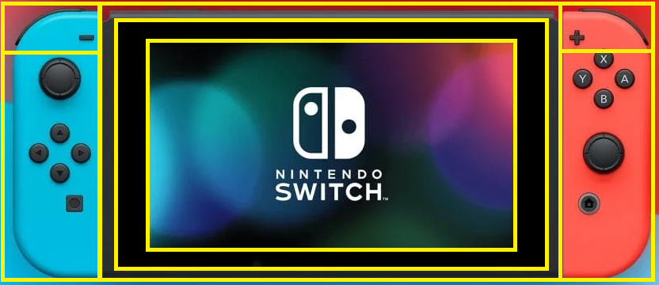
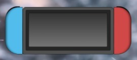
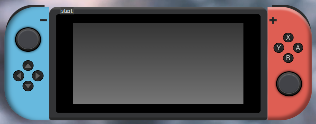
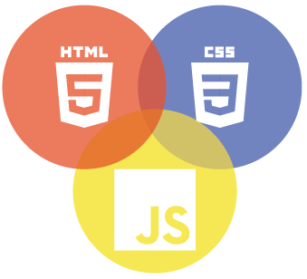
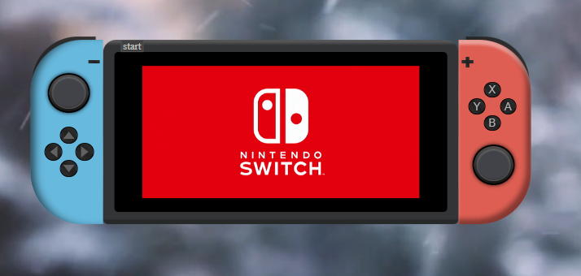
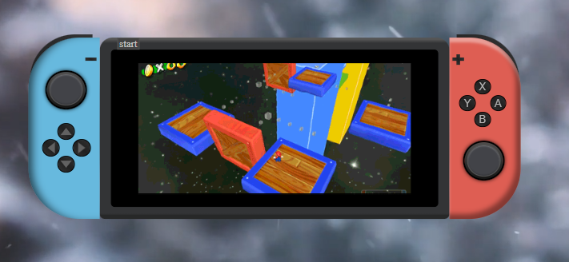
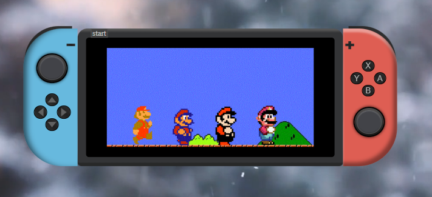

# Nintendo Switch

La nintendo Switch es una consola de videojuegos desarrollada por Nintendo, es considerada una consola híbrida. Puede ser utilizada de sobremesa con la unidad principal insertada en una estación de acoplamiento que permite conectarla a un televisor y también puede ser extraida y utilizada como una tablet a través de su pantalla táctil o incluso se puede colocar en una superficie y ser manipulada con los mandos extraibles. 

## Contenido

- [Introducción](#introducción)
- [Características](#características)
- [Tecnologías](#tecnologías-utilizadas) 
- [Captura de Pantalla](#capturas-de-pantalla)
 
## Introducción

En el segundo proyecto nos han pedido crear una videoconsola con HTML, CSS y JS, nos han permitido elegir la que quisieramos y entre tantas opciones escogí crear esta debido a su complejidad para poder conocer un poco más de estos lenguajes además de ponerme el reto a mi mismo de crear algo que no fuera tan sencillo. 

## Características

Este proyecto consta de dos documentos HTML, uno de inicio, donde se muestra una invitación a disfrutar de la Nintendo Switch y que nos muestra un boton de acceso que nos lleva a la siguiente página donde se encuentra la videoconsola. 
Se puede observar que esta consta de dos mandos laterales, cada uno cuenta con el boton correspondiente y todos los botones tienen una función. 
Las funciones añadidas son: 
- Start: Enciende/apaga la videoconsola
- Next: Pasa a la siguiente animación 
- Previous: Permite retroceder a la animación anterior. 

Todo el diseño ha sido creado con divs, no se han insertado imagenes para simular botones ni flechas. En la siguiente imagen, se pueden observar los principales divs que componen la videoconsola:

En este momento, ya se había hecho el formato principal,

En la siguiente imagen podemos observar el resultado final.

## Tecnologías Utilizadas

 
 ## Futuras mejoras

En la vida, todo se puede mejorar. Algunas cosas que me gustaría mejorar son: 
 - Añadir efectos de sonido.
 - Programar algún tipo de juego que se pueda ejecutar con los botones de esta  videoconsola.
 - Añadir más funciones. 

## Capturas de Pantalla

